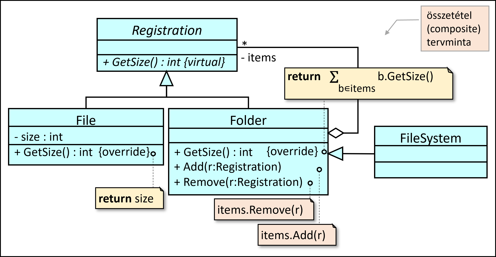

# 3. kis beadandó

- Egy számítógépes fájlrendszerben a fájlokat könyvtárakba szervezzük. Minden könyvtár tetszőleges számú fájlt vagy könyvtárat tartalmazhat. A fájlrendszerben a fájlok lehetnek közvetlen a fájlrendszerhez kötve (gyökér), vagy valamelyik     könyvtárban is elhelyezkedhetnek. Mennyi tárhelyet foglal egy adott könyvtár?



A feladat implementálása után az alábbi beolvasóval töltsétek fel a megoldást tms-re.

minta input: 
```
K
  F 3
V
```

output:

3