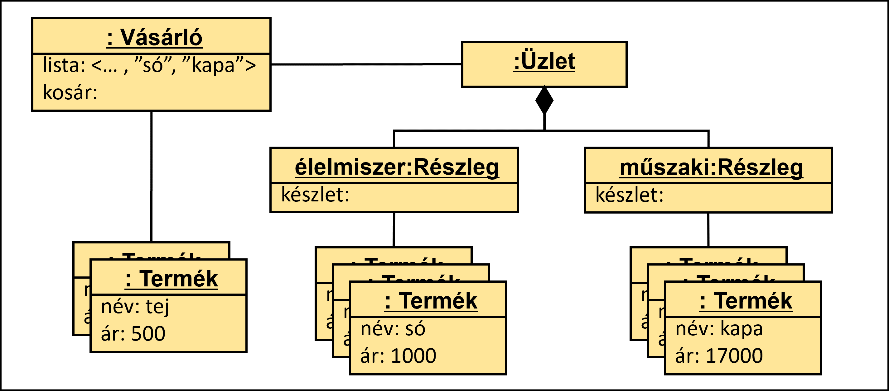
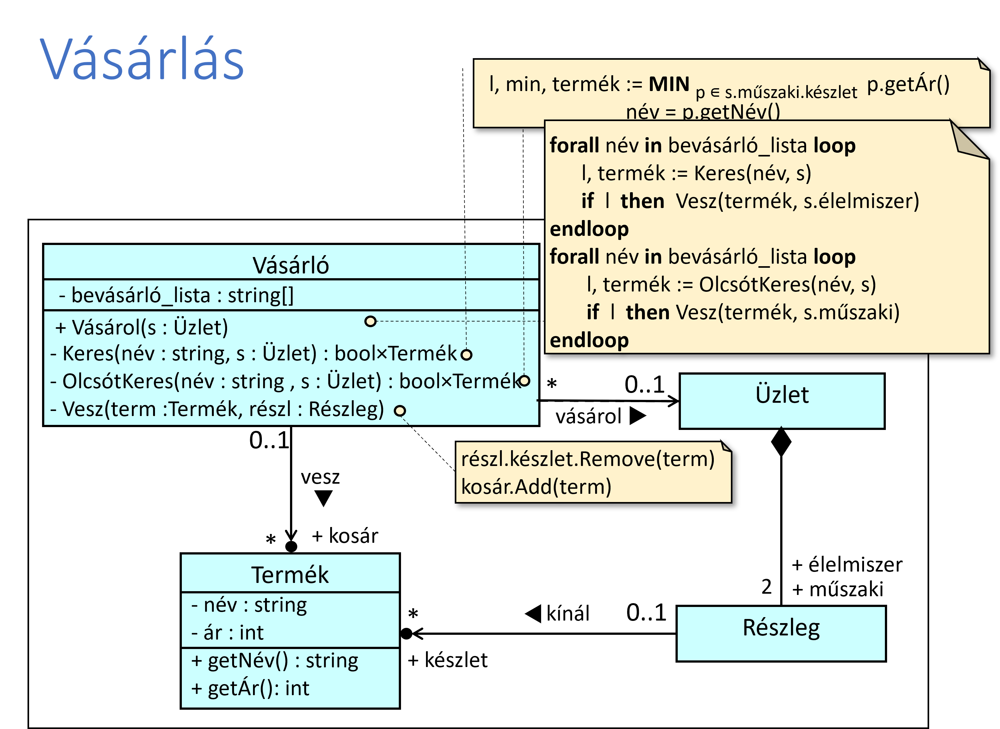
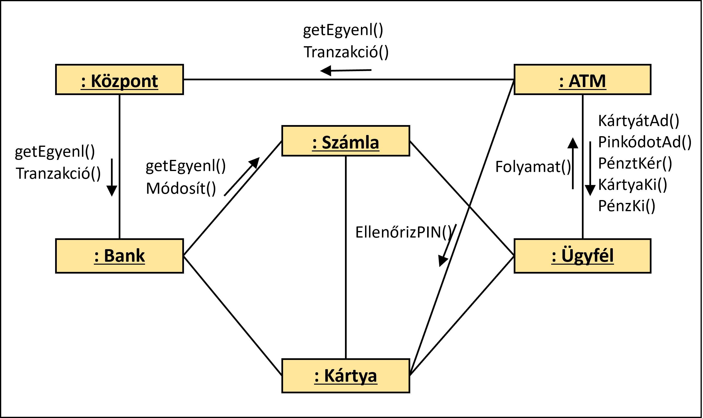
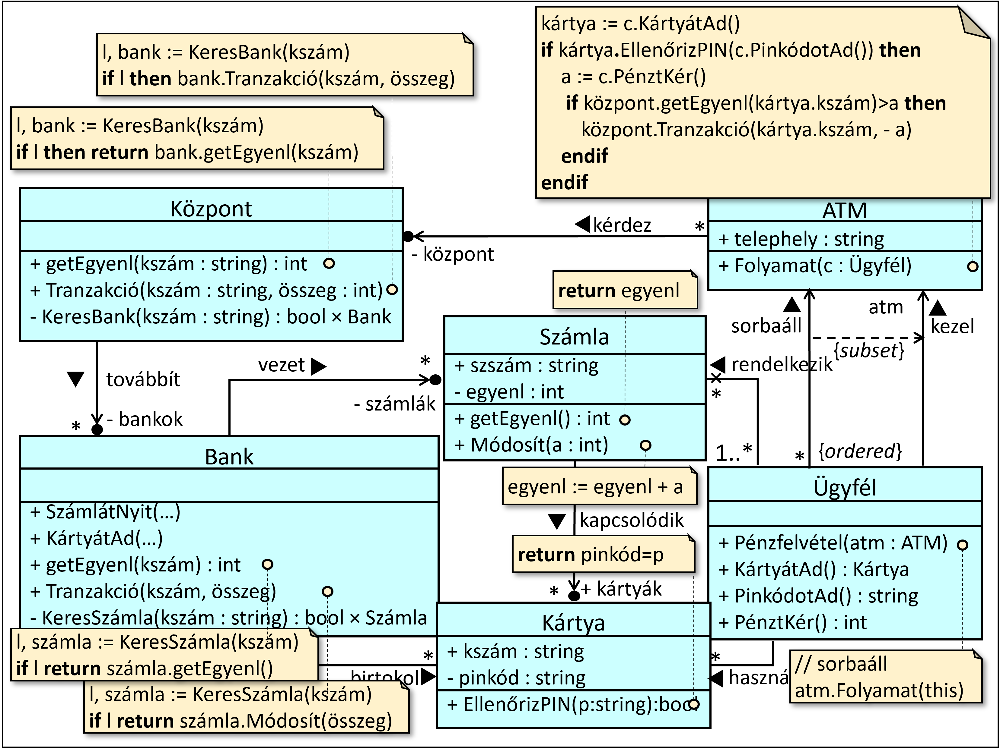

# 8. gyakorlat


## Feladatok
1. Egy kisvárosi üzlet élelmiszer részlegből és műszaki részlegből áll, ahová a vásárlók egy bevásárlólistával jönnek, amely azon termékek neveit tartalmazza, amit megvennének.  Az üzletben a listájukon szereplő termékeket keresik: először az élelmiszer részlegen nézik végig a teljes bevásárlólistát, és a megtalált termékeket magukhoz veszik (beteszik a kosarukba), majd a műszaki részlegen ezt megismétlik, de megfontoltabban: ha egy (a bevásárlólistán szereplő) termékből több is van a részlegen, akkor a legolcsóbbat választják.




### Input:
[food.txt](.\Shop\Shop\inputs\food.txt)

[tech.txt](.\Shop\Shop\inputs\tech.txt)

### Elvárt kimenet:
```
Minta_Bela vásárló megvette az alábbi árukat: 
Alma 450
Korte 320
Kola 350
Lampa 1500
Telefon 10000
```

2. Egy ATM automatánál az ügyfelek sorban állnak, hogy pénzt vehessenek fel. Az ügyfelek rendelkeznek bankkártyákkal. Egy bankkártya egy bankszámlához tartozik, és van egy PIN kódja. Egy ügyfél odaadja a bankkártyáját és a PIN kódját az ATM-nek, és az ellenőrzi ennek hitelességét. Ezután az ügyfél megadja a felvenni kívánt összeget. Ha az összeget levonva az ügyfél számlájának egyenlegéből az továbbra is pozitív marad, akkor az ATM kiadja az összeget. Ehhez a folyamathoz az ATM egy központon keresztül lekéri az ügyfél számlaegyenlegét a kártyájának adatai alapján, illetve elküld a egy jelentést a lebonyolított tranzakcióról az ügyfél bankjának, amely ezalapján leveszi az összeget az ügyfél számlájáról.




