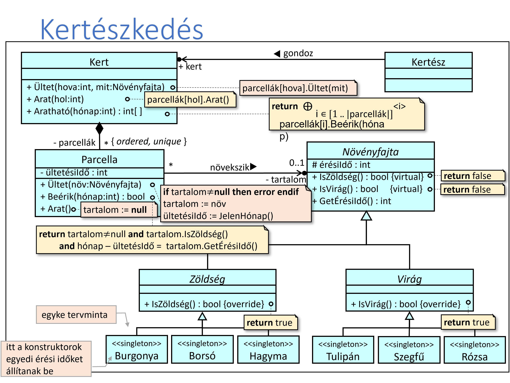

# 9. gyakorlat

## feladatok

1. Egy kertet egy kertész gondoz. A kert parcellákból áll, minden parcellába egyféle növényfajta ültethető. A növényfajták lehetnek zöldségek, mint burgonya, borsó, paprika; vagy virágok, mint tulipán, szegfű, rózsa. Ismerjük egy növény érési idejét, a parcellákba történt ültetés idejét (hónapban). Mely parcellákban fognak beérni zöldségek egy adott hónapban? (Hol lehet aratni?)

terv:

