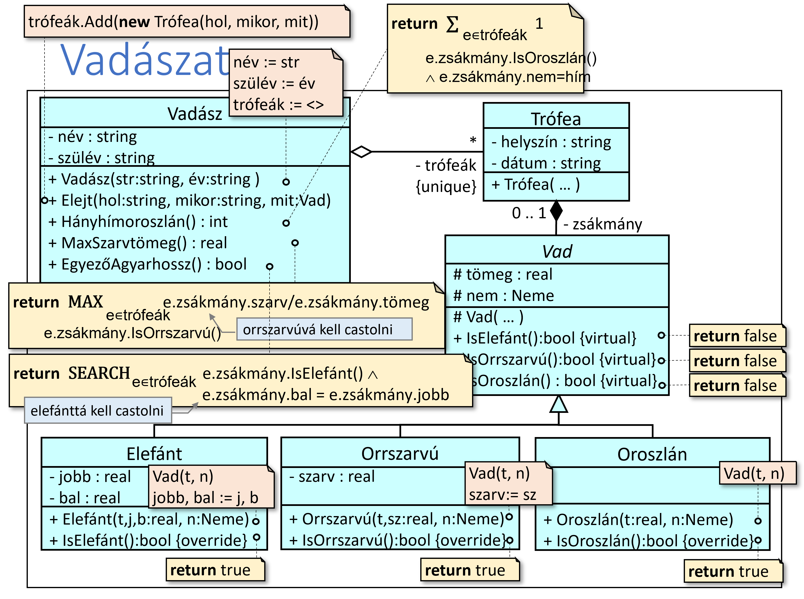
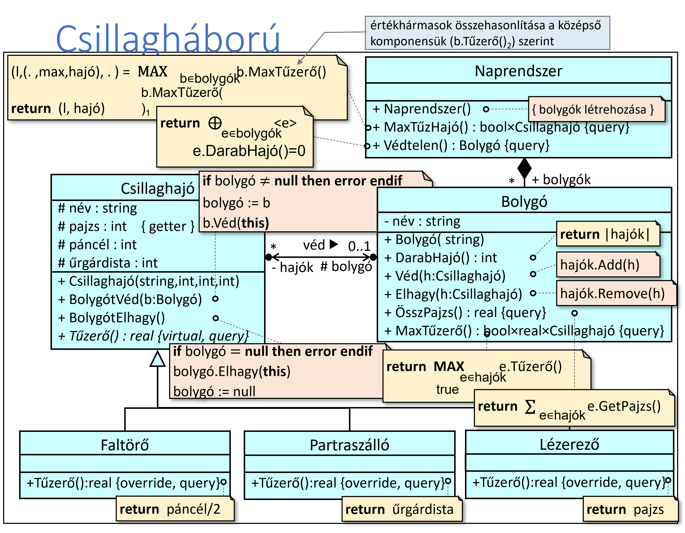

# 10. gyakorlat

## feladatok

1. Vadászat: Egy vadász (név és az életkor) számos trófeát gyűjtött. Egy trófeán az elejtett vad fajtáját (elefánt, orrszarvú, oroszlán), az elejtés helyét és dátumát, az elejtett vad tömegét (kg-ban), valamint egy különleges adatot: elefántok esetén agyarainak hosszát  külön-külön (cm-ben), orrszarvúaknál a szarvának tömegét, oroszlánoknál a vad nemét (hím vagy nőstény) értjük. Adjunk választ az alábbi kérdésekre:
   - Hány hímoroszlánt lőtt egy adott vadász?
   - Melyik egy vadász legnagyobb szarv/testtömeg arányú orrszarvú-zsákmánya?
   - Van-e egy vadásznak azonos agyarhosszú elefánt-zsákmánya?

terv:

[input.txt](./input/input.txt)

2. StarWars: A bukott légiók útban vannak a Birodalom központi naprendszere felé Horus Lupercal vezetésével, hogy megdöntsék a Császár hatalmát. Ahogy az áruló sereg közeleg, a birodalomhoz hűséges bolygók egymás után borulnak sötétségbe a naprendszer körül. Az utolsó reményt azok a hűséges csillaghajók jelentik, amelyek a naprendszer bolygóinál gyülekeznek … 
   
Egy csillaghajónak van neve; tudjuk, ha a naprendszer egyik bolygóját védi, akkor tudjuk, hogy melyiket; ismert a páncélozottsága (egész szám), a pajzserőssége (egész szám), és hogy hány űrgárdista teljesít szolgálatot rajta. 
Három fajta csillaghajó van: faltörő, partraszálló, és lézerező. Egy csillaghajó tűzereje a fajtájától és a tulajdonságaitól függ:
- faltörő tűzereje a páncélozottságának a fele 
- partraszálló tűzereje az űrgárdistáinak száma
- lézerező tűzereje megegyezik a pajzserejével

1. Keressük meg a legnagyobb tűzerejű csillaghajót a naprendszerben!
2. Listázzuk ki azokat a bolygókat, amelyeket nem véd csillaghajó!
3. Mennyi egy adott bolygónál állomásozó csillaghajók összpajzsereje!

terv: 

