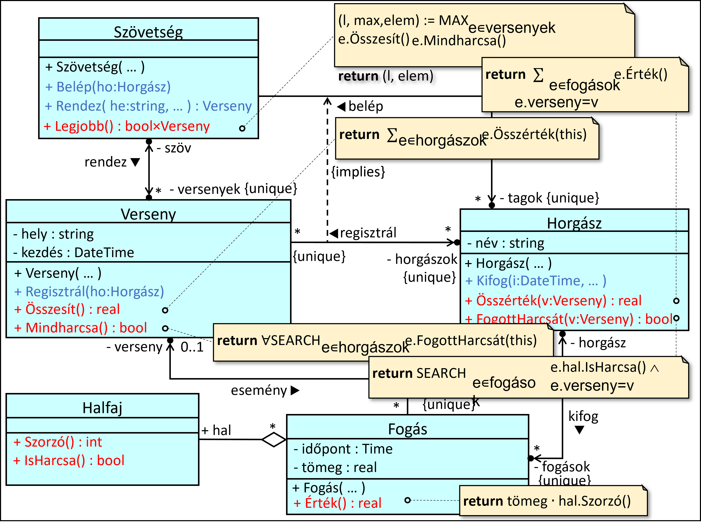
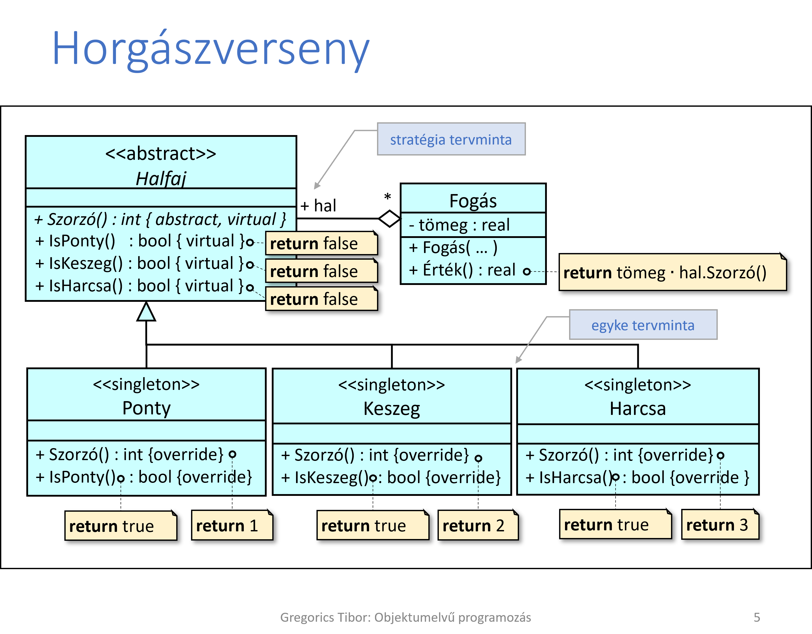

# Horgászverseny

Egy horgászszövetség több horgászversenyt is rendez, amelyekre csak a szövetség tagjai nevezhetnek be; ugyanaz a horgász több versenyen is részt vehet. A versenyeknek ismert a helyszíne. A horgászoknak ismerjük a nevét, tudjuk, hogy milyen fogásaik voltak az egyes versenyeken. Egy fogás leírja, hogy melyik versenyen fogták, ki volt a horgász, mi a kifogott hal fajtája és a tömege (kg-ban). A halak fajtája lehet ponty, keszeg, vagy harcsa. A hal értéke a hal tömegének és a halfajta szorzójának (harcsa:3, ponty:2, keszeg:1) szorzata.

Melyik a legeredményesebb verseny: ahol a horgászok fogásainak összértéke a legnagyobb és mindenki fogott harcsát?

## input

[input](./FishingContest/FishingContest/input)

## Terv

