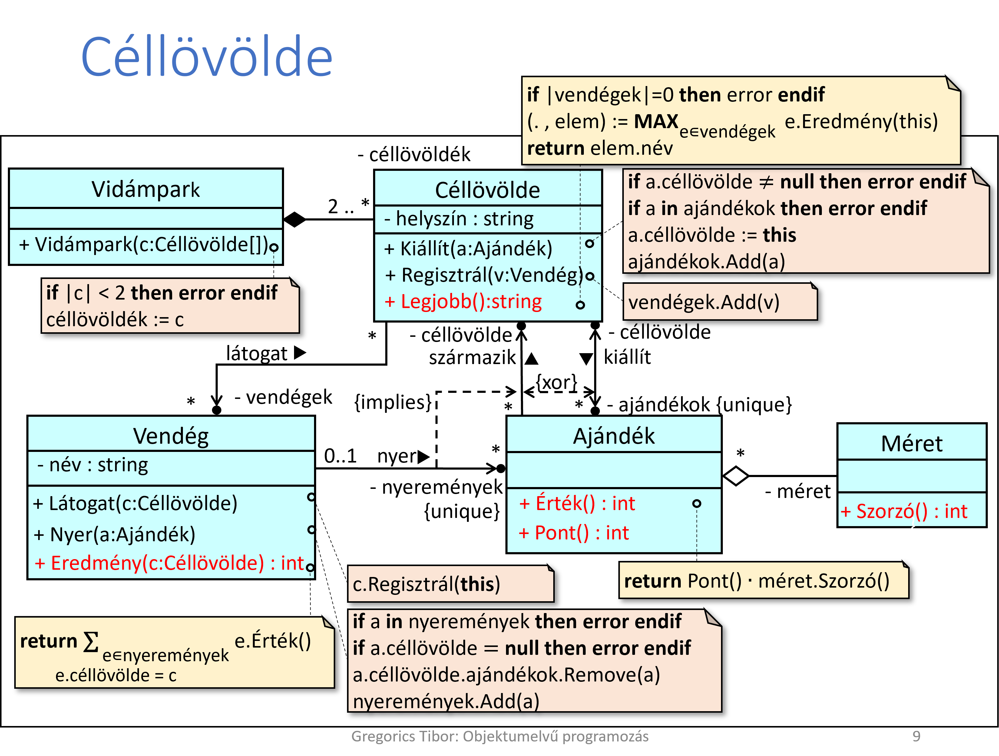
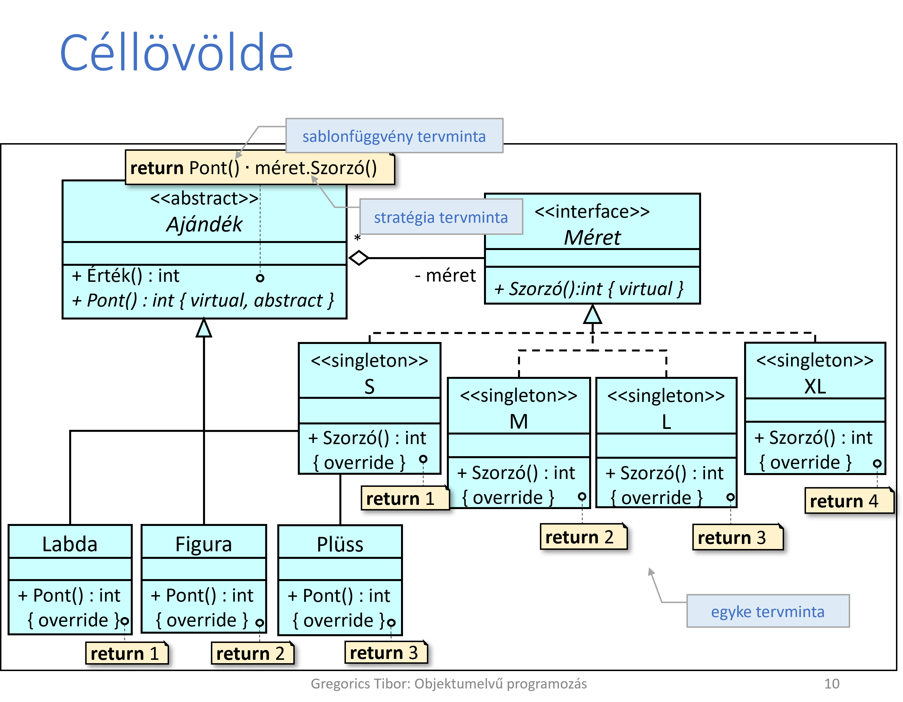
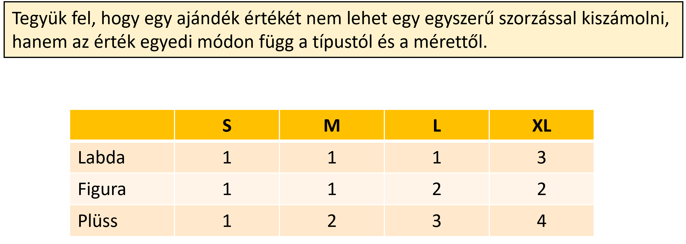
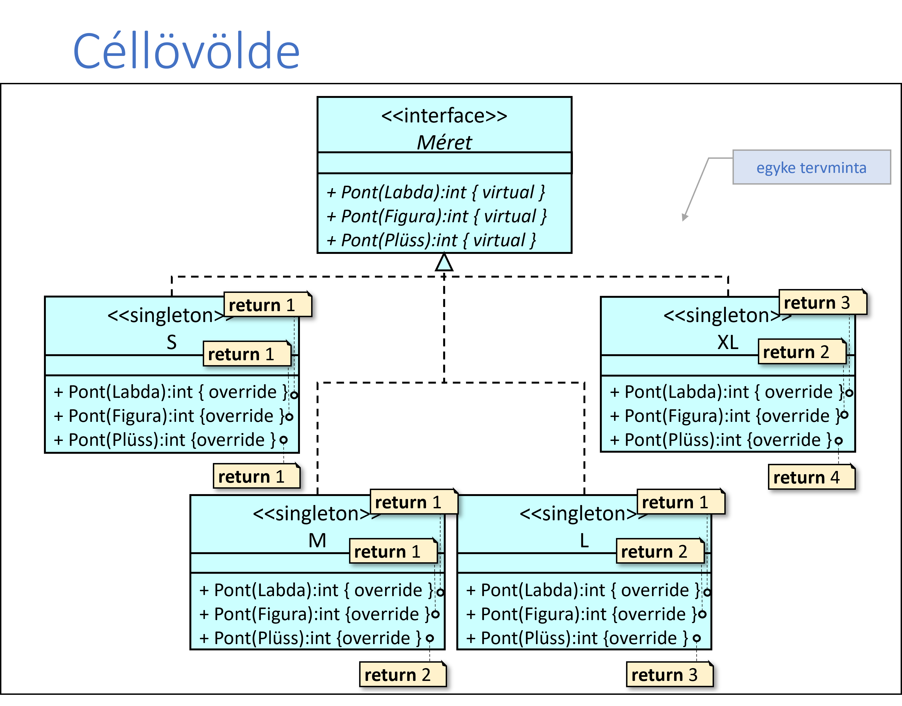
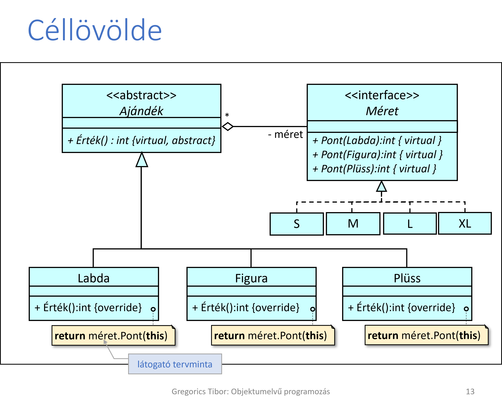

# Céllövölde

2. Egy vidámpark különböző helyszíneken több céllövöldét is üzemeltet. A vidámpark vendégei akár több különböző céllövöldében is szerencsét próbálhatnak. Egy vendég egy céllövöldében minden sikeres találat esetén ajándékot nyer. Az ajándékokról később is tudható, hogy melyik céllövöldében nyerték. Egy ajándék  típusa szerint lehet  labda, műanyag figura, vagy plüss állat, és négy különböző méretben fordulhat elő: S, M, L, XL.  
Egy-egy ajándék értékét úgy számolhatjuk ki, hogy a típusa után járó pontszámot (plüss állatra 3 pont, műanyag figurára 2 pont, labdára 1 pont) megszorozzuk a mérete után járó szorzóval (az S méret 1 pont, az M 2 pont, az L 3 pont, az XL 4 pont). 

Nevezzük meg egy céllövölde legjobb céllövőjét, azaz azt a vendéget, aki által a céllövöldében nyert ajándékok összértéke a legnagyobb!

## input

A feladatnak nincs inputja az előre elkészített main-nel lehet kipróbálni.

## terv

## alternatív feladat:

